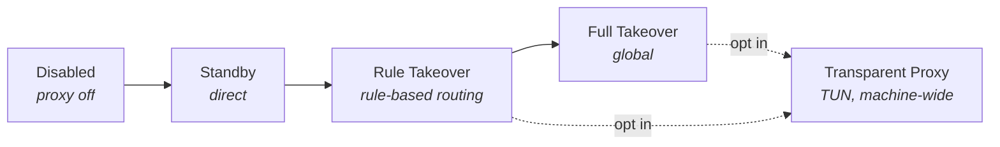

# `Clash#`

**کلاینت پروکسی بومی و مدرن Windows بر پایه هسته [mihomo](https://github.com/MetaCubeX/mihomo).**

[English](./README.md) · [简体中文](./README-zh.md) · [Русский](./README-ru.md) · **فارسی**

---

> [!IMPORTANT]
> **نسخه 1.0.0 در حال توسعه است و اکنون روی یک نقطه بازرسی تأییدشده متوقف شده است.**
> نقطه بازرسی `main` [`065a5d5`](https://github.com/Water-Run/ClashSharp/commit/065a5d5) با برچسب [`v1.0.0-checkpoint.20260912`](https://github.com/Water-Run/ClashSharp/releases/tag/v1.0.0-checkpoint.20260912) است.
> هنوز انتشار رسمی وجود ندارد — بسته‌های CI فقط برای اعتبارسنجی هستند، نه انتشار.

| حوزه | وضعیت در نقطه بازرسی |
| :--- | :--- |
| **آزمایش‌ها** | ۴۸۰۰ آزمایش محلی موفق — صفر شکست، صفر رد شدن |
| **ساخت** | ساخت Release x64 برای ۱۸ پروژه — صفر هشدار، صفر خطا |
| **نصب‌کننده** | نصب، تعمیر و حذف واقعی، هشت بازیابی وقفه/قفل پرونده، بازیابی دسته سرویس اشغال‌شده، و بازیابی پس از راه‌اندازی مجدد Windows |
| **زمان اجرا** | بارگذاری مجدد واقعی هسته، بازیابی کران‌دار پس از فروپاشی، جداسازی نشست پس از راه‌اندازی مجدد میزبان سرویس، و حذف هنگام هسته فعال |
| **شبکه** | ۳۲/۳۲ آزمایش گره جداشده و ارسال HTTPS روی پیکربندی موجود Clash |
| **باقی‌مانده** | تعامل صفحات WPF، خروج عادی، پاک‌سازی خودکار پوشه‌های خالی، ماتریس کامل انتشار |

نامزدهای دقیق، مرز شواهد، کار باقی‌مانده و مستندات بعدی: **[وضعیت فعلی توسعه](./docs/reviews/2026-09-17-development-status.md)** · **[دفتر اجرای 1.0.0](./docs/reviews/1.0.0-execution-ledger.md)** · [نقطه بازرسی توقف](./docs/reviews/2026-09-12-pause-checkpoint.md) · [پذیرش سرور](./docs/reviews/2026-09-12-server-acceptance.md)

## بومی Windows از روی طراحی

Clash# فراتر از زنجیره ابزار بومی است — `C#` به‌همراه WinUI 3، طراحی صفحه Fluent و بسته‌بندی `.msix` پی هستند، نه مجموعه قابلیت. برنامه حول رفتار شبکه Windows ساخته شده، نه اصطلاحات عمومی پروکسی چندسکویی.

| حوزه | آنچه Clash# فراهم می‌کند |
| :--- | :--- |
| **پوسته** | کنترل‌های بومی WinUI 3، شمایل Fluent و سطح اکریلیک Windows 11 |
| **کنترل اصلی** | سطح کاشی‌محور برای وضعیت و اقدام‌های رایج، بر الگوی تنظیمات سریع Windows |
| **چرخه عمر** | نصب‌کننده/حذف اختصاصی، و تشخیص و تعمیر تداخل پروکسی هنگام راه‌اندازی |
| **بازیابی** | هنگام خروج غیرعادی، Recovery Watchdog یک‌بارمصرف فوراً پروکسی سیستمی را که هنوز متعلق به Clash# است بازمی‌گرداند؛ کمک‌کننده ورود فقط پشتیبان ورود بعدی است |
| **ابزار تعمیر** | تعمیر سریع شبکه برای WSL، پایانه‌ها و Microsoft Store؛ پاک‌سازی باقی‌مانده پروکسی؛ بازگردانی پروکسی سیستم هنگام خروج |
| **تصاحب** | فعال‌سازی پروکسی شفاف fail-closed از طریق TUN |
| **زبان‌ها** | کاتالوگ رابط برای چینی ساده‌شده، چینی سنتی، انگلیسی، روسی، فرانسوی، آلمانی و فارسی (چینش راست‌به‌چپ) |

## نصب

> [!NOTE]
> پس از انتشار نسخه رسمی، بسته‌ها در [GitHub Releases](https://github.com/Water-Run/ClashSharp/releases) ظاهر می‌شوند.

1. بسته انتشار را بارگیری و از حالت فشرده خارج کنید. شامل `ClashSharp-Installer.exe` و پوشه هم‌تراز `payload` است — **آن‌ها را کنار هم نگه دارید**.
2. `ClashSharp-Installer.exe` امضاشده با Authenticode را **از نشست عادی کاربر** اجرا کنید. نصب‌کننده یک اجرایی خودکفای WPF است و به .NET ازپیش‌نصب‌شده نیاز ندارد.
3. درخواست UAC برای سرویس ماشین و هر اعتماد لازم به گواهی ماشین را بپذیرید — **ابتدا ناشر تأییدشده را بررسی کنید**. بسته برنامه متعلق به کاربری است که نصب‌کننده را اجرا کرده است.

نصب‌کننده سازگاری Windows 11 x64 را بررسی می‌کند، در صورت نیاز گواهی بسته را نصب می‌کند و بسته MSIX را مستقر می‌کند. پرونده‌های تأییدشده گواهی و MSIX — و زنجیره پوشه آن‌ها — در طول هر مصرف‌کننده قفل فقط‌خواندنی می‌مانند و هویت و SHA-256 بلافاصله پیش و پس از استفاده دوباره بررسی می‌شود. پس از استقرار، هر پرونده مؤلف بسته در برابر payload نقشه بلوک امضاشده تأیید می‌شود و MSIX اعمال یکپارچگی بسته Windows را فعال می‌کند.

اگر Clash# از پیش نصب شده باشد، نصب‌کننده وارد **حالت نگهداری** می‌شود: بررسی، به‌روزرسانی/تعمیر درجا، یا حذف.

> [!WARNING]
> حذف را همیشه از طریق `ClashSharp-Installer.exe` انجام دهید. برداشتن فقط MSIX از تنظیمات Windows می‌تواند منابع سرویس سطح ماشین را باقی بگذارد.

<b>تضمین‌های ساخت انتشار و امضا</b>

 

حل وابستگی و مونتاژ payload انتشار **کاملاً آفلاین** است: هر پروژه .NET از locked restore قبلی استفاده می‌کند.

- ساخت **با شکست بسته می‌شود** مگر اینکه مانیفست نسخه‌/طول/SHA-256 ثبت‌شده Mihomo با باینری معمولی همراه مطابقت داشته باشد، و هر چهار دارایی ثابت GeoData با `Tools\Prepare-GeoData.ps1` آماده شده باشند.
- `Tools\Update-Mihomo.ps1` ابزار صریح نگهدارنده است — **هرگز** بارگیری ضمنی ساخت انتشار نیست.
- هر اجرا از ریشه staging تصادفی تازه استفاده می‌کند و فقط وابستگی واحد x64 Windows App Runtime اعلام‌شده در مانیفست را می‌پذیرد و اثر انگشت تأییدشده آن را در `CLASHSHARP_WINDOWS_APP_RUNTIME_SIGNER_THUMBPRINT` می‌خواهد.
- بسته‌بندی رسمی همچنین به مواد امضای کنترل‌شده MSIX، گواهی Authenticode مطمئن با مهر زمانی، و `CLASHSHARP_WINDOWS_SDK_VERSION` صریح نیاز دارد. SignTool فقط از آن پوشه Windows Kits x64 امضاشده Microsoft پذیرفته می‌شود و امضا فقط با نقطه پایانی HTTPS مهر زمانی صریحاً پیکربندی‌شده تماس می‌گیرد.
- نصب‌کننده WPF به‌صورت یک اجرایی خودکفا در staging دورریختنی منتشر می‌شود و فقط پس از بررسی مجدد مجموعه دقیق پرونده‌ها، طول و SHA-256 به `artifacts\installer\release` ارتقا می‌یابد.
- `build.ps1 -Development` یک محصول بدون امضا با نام صریح و غیرقابل انتشار می‌سازد.

## حالت‌ها و مفاهیم

Clash# حالت‌ها را بر اساس کاری که با Windows می‌کنند نام‌گذاری می‌کند؛ نگاشت به اصطلاحات رایج چنین است:

| مفهوم در `Clash#` | معادل رایج | معنا |
| :--- | :--- | :--- |
| کنترل اصلی | نمای کلی / خانه | صفحه کنترل اصلی |
| غیرفعال | خاموش | پروکسی فعال نیست |
| آماده | Direct | پروکسی فعال، حالت مستقیم |
| تصاحب بر اساس قانون | Rule | پروکسی فعال، حالت قانون |
| تصاحب کامل | Global | پروکسی فعال، حالت سراسری |
| پروکسی شفاف | حالت TUN | پروکسی از طریق TUN فعال است |

درگاه شنود پیش‌فرض **`10000`** است.

> [!CAUTION]
> پروکسی شفاف باید در تنظیمات روشن شود و تصاحب TUN **در کل ماشین** است. Clash# برای یک کاربر تعاملی و یک مالک Core در هر ماشین طراحی شده؛ **ایزوله ترافیک چندنشستی ندارد**. پس از آزاد شدن اجرای نصب‌کننده، بازپیوند مالکیت باید توسط کاربر هدف شروع و در Repair صریحاً تأیید شود — Repair عادی مالکیت را ضمنی عوض نمی‌کند.

## استفاده

برای استفاده از Clash# به اشتراک Clash نیاز دارید.

| صفحه | کاربرد |
| :--- | :--- |
| **کنترل اصلی** | جابه‌جایی میان غیرفعال، آماده، تصاحب بر اساس قانون و تصاحب کامل |
| **پروکسی‌ها** | گره‌ها، پیکربندی‌ها، پیوندهای اشتراک و قوانین |
| **آمار** | سوابق ترافیک و برخورد قوانین در SQLite |
| **گزارش‌ها** | ذخیره گزارش کران‌دار و پایدار |

### پیشرفته

کاربران پیشرفته می‌توانند حالت پروکسی شفاف، نمونه‌برداری پس‌زمینه اتصال، ورود و اعتبارسنجی پیکربندی، آزمایش تأخیر گره، اقدام‌های تعمیر بومی Windows، پاک‌سازی گزارش SQLite و رفتار نمایش چین قاره‌ای را پیکربندی کنند.

> [!TIP]
> نمایش چین قاره‌ای **به‌صورت پیش‌فرض روشن است**. فقط متن نمایش منطقه و پرچم را در لایه رابط تغییر می‌دهد — پیکربندی‌ها، گزارش‌ها، جستجو، رونوشت و داده صادرشده هرگز تغییر نمی‌کنند.

زبان رابط می‌تواند از Windows پیروی کند یا صریحاً انتخاب شود. فارسی از چینش راست‌به‌چپ استفاده می‌کند.

## مستندات

| سند | محتوا |
| :--- | :--- |
| [وضعیت فعلی توسعه](./docs/reviews/2026-09-17-development-status.md) | جایگاه 1.0.0، بازیابی PR بسته‌شده، و کار باقی‌مانده |
| [دفتر اجرای 1.0.0](./docs/reviews/1.0.0-execution-ledger.md) | نقاط عطف، نامزدها، شواهد و کار باقی‌مانده |
| [نقطه بازرسی توقف](./docs/reviews/2026-09-12-pause-checkpoint.md) | مرز دقیق و نقاط ازسرگیری توقف فعلی |
| [پذیرش سرور](./docs/reviews/2026-09-12-server-acceptance.md) | شواهد نصب، راه‌اندازی، تعمیر و حذف بسته واقعی |
| [یادداشت‌های طراحی](./docs/design) | سوابق طراحی هر قابلیت |
| [دفتر معماری](./docs/architecture/stabilization-ledger.md) | تاریخ پایدارسازی معماری |
| [سبک کدنویسی](./CodingStyle.md) | قراردادهای مخزن |

## مجوز

`Clash#` تحت مجوز [`AGPL-3.0`](./LICENSE) متن‌باز است.

