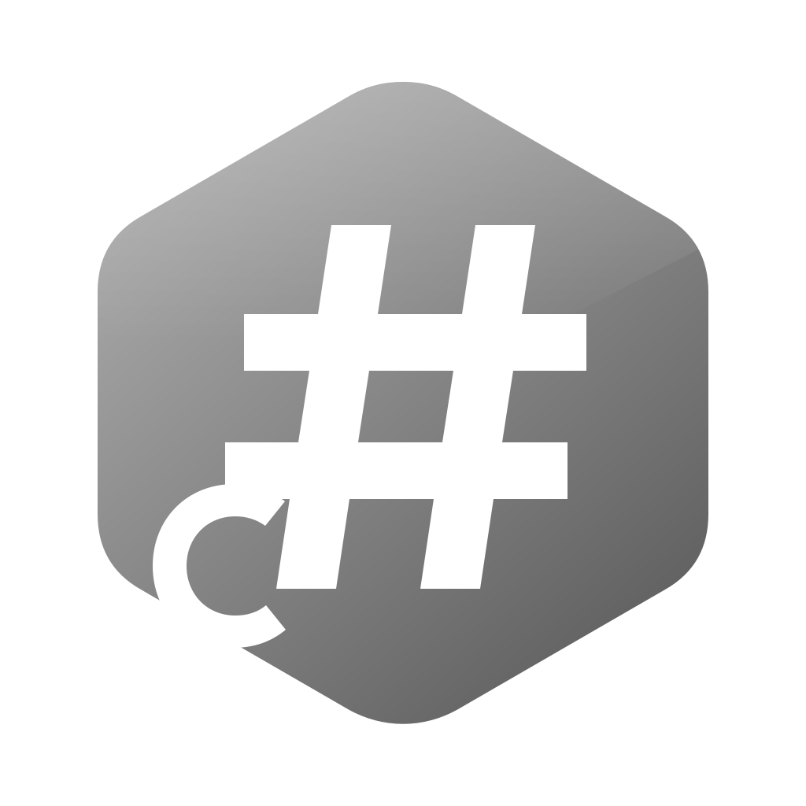

<div dir="rtl">

<div align="center" dir="ltr">


# Clash#

</div>

<div align="center">

**کلاینت پروکسی بومی Windows بر پایهٔ هستهٔ mihomo**

</div>

<div align="center" dir="ltr">

[](https://github.com/Water-Run/ClashSharp/actions/workflows/ci.yml)
[](./LICENSE)
[](#نصب)
[](./global.json)

[English](./README.md) · [简体中文](./README-zh.md) · [繁體中文](./README-zh-Hant.md) · [한국어](./README-ko.md) · [Русский](./README-ru.md) · **فارسی**

</div>

> [!IMPORTANT]
> ‏Clash# 1.0.0 در دست توسعه است و نسخهٔ رسمی منتشرشده‌ای ندارد. بسته‌های تولیدشده توسط CI نسخه‌های آزمایشی امضانشده‌اند و برای استفادهٔ روزمره در نظر گرفته نشده‌اند.

‏Clash# یک کلاینت پروکسی بومی Windows بر پایهٔ هستهٔ [mihomo](https://github.com/MetaCubeX/mihomo) است. برنامهٔ اصلی با C#،‏ .NET 10 و WinUI 3 نوشته شده و به‌صورت بستهٔ MSIX توزیع می‌شود؛ نصب، تعمیر و حذف آن بر عهدهٔ یک نصب‌کنندهٔ مستقل WPF است. سیستم‌های پشتیبانی‌شده Windows 11 x64 و Windows Server 2025 همراه با Desktop Experience هستند.

افزون بر مدیریت اشتراک‌ها، پیکربندی‌ها، گره‌ها و قوانین، Clash# به چند مسئلهٔ مشخص در Windows می‌پردازد: تصاحب و بازگردانی پروکسی سیستم، پروکسی شفاف (TUN) در سطح کل رایانه، دسترسی WSL، ترمینال‌ها و برنامه‌های Microsoft Store به پروکسی، و تنظیمات پروکسی باقی‌مانده پس از خروج غیرعادی.

## قابلیت‌ها

| حوزه | توضیح |
| :--- | :--- |
| **رابط کاربری** | کنترل‌های بومی WinUI 3، نمادهای Fluent و جنس‌های Windows 11، با پشتیبانی از پوستهٔ روشن، تیره و رنگ تأکیدی سیستم. صفحهٔ «کنترل اصلی» از کاشی‌ها تشکیل شده و کاشی‌ها قابل نمایش، پنهان‌سازی و مرتب‌سازی‌اند. |
| **بررسی هنگام راه‌اندازی** | پیش از شروع پروکسی، فرایندهای خارجی mihomo، درگاه‌های اشغال‌شده، پروکسی دستی Windows و دیگر آداپتورهای TUN/VPN بررسی می‌شوند و برای مواردی که به‌طور ایمن قابل رسیدگی‌اند، اصلاح ارائه می‌شود. |
| **بازگردانی پروکسی** | پروکسی سیستم هنگام خروج بازگردانده می‌شود؛ پس از خروج غیرعادی، فرایند بازیابی بی‌درنگ آن را بازمی‌گرداند؛ هنگام راه‌اندازی، تنظیمات پروکسی باقی‌مانده بررسی و پاک می‌شوند. |
| **اصلاح شبکهٔ Windows** | دسترسی WSL، ترمینال‌ها و Microsoft Store به پروکسی جداگانه عیب‌یابی می‌شود و اصلاح هر مورد به‌طور مستقل اعمال یا بازگردانده می‌شود. |
| **محرک‌ها** | با برقراری همهٔ شرط‌ها، کنش‌های ازپیش‌تعیین‌شده به ترتیب اجرا می‌شوند. شرط‌ها شامل ترافیک، سرعت، تعداد اتصال، مدت اجرا و زمان سیستم‌اند؛ کنش‌ها شامل تغییر حالت، قطع اتصال‌ها، ارسال اعلان و خروج از برنامه‌اند. |
| **آمار و گزارش‌ها** | سوابق ترافیک، اتصال‌ها، سلامت گره‌ها و برخورد قوانین در پایگاه‌دادهٔ محلی SQLite ذخیره می‌شوند. |
| **زبان‌های رابط** | 简体中文، 繁體中文، English، 한국어، Русский، Français، Deutsch، فارسی (چینش راست‌به‌چپ). |

## حالت‌ها

‏Clash# هر حالت را بر اساس اثر آن بر شبکه نام‌گذاری می‌کند. تطابق با اصطلاحات رایج کلاینت‌ها:

| Clash# | نام رایج | رفتار |
| :--- | :--- | :--- |
| **غیرفعال** | خاموش | هسته متوقف و پروکسی سیستم بازگردانده می‌شود. |
| **آماده** | مستقیم | هسته در حال اجراست و ترافیک به‌طور پیش‌فرض مستقیم می‌رود. |
| **تصاحب بر اساس قانون** | قانون | ترافیک طبق قوانین پیکربندی مسیریابی می‌شود. |
| **تصاحب کامل** | سراسری | همهٔ ترافیک از پروکسی انتخاب‌شده عبور می‌کند. |

پروکسی شفاف (TUN) با گزینهٔ «پروکسی شفاف» در **تنظیمات › پروکسی** کنترل می‌شود و به‌طور پیش‌فرض روشن است. در صورت روشن بودن و در دسترس بودن سرویس Mihomo، تصاحب از طریق TUN انجام می‌شود و برنامه‌هایی را که پروکسی سیستم را نمی‌خوانند نیز در بر می‌گیرد. در صورت مستقر نبودن سرویس Mihomo، تصاحب از طریق پروکسی سیستم Windows انجام می‌شود.

> [!CAUTION]
> پروکسی شفاف مسیریابی و DNS کل رایانه را تصاحب می‌کند. Clash# برای یک رایانه با یک کاربر تعاملی طراحی شده و ترافیک نشست‌های کاربری مختلف را از یکدیگر جدا نمی‌کند.

با روشن بودن «فعال‌سازی نشانگر رنگی وضعیت سینی» در **تنظیمات › سینی نوار وظیفه**، نماد سینی وضعیت فعلی را با رنگ نشان می‌دهد:

|  |  |  |
| :---: | :---: | :---: |
| غیرفعال یا آماده | پروکسی سیستم | پروکسی شفاف |

## نصب

**پیش‌نیازهای سیستم:** ‏Windows 11 x64، یا Windows Server 2025 همراه با Desktop Experience.

پس از انتشار نسخهٔ رسمی، بسته‌ها در صفحهٔ [Releases](https://github.com/Water-Run/ClashSharp/releases) منتشر می‌شوند.

1. بستهٔ انتشار بارگیری و از حالت فشرده خارج می‌شود. `ClashSharp-Installer.exe` باید کنار پوشهٔ `payload` باقی بماند.
2. ‏`ClashSharp-Installer.exe` در نشست کاربری جاری اجرا می‌شود. برنامه برای کاربری که نصب‌کننده را اجرا کرده نصب می‌شود؛ اجرا با دسترسی مدیر و نصب پیشین .NET لازم نیست.
3. هنگام استقرار سرویس Mihomo و اعتماد لازم به گواهی‌ها، نصب‌کننده تأیید مدیر را درخواست می‌کند. پیش از تأیید، ناشر نمایش‌داده‌شده باید بررسی شود.

تعمیر، ارتقا و حذف همگی با اجرای دوبارهٔ همان نصب‌کننده انجام می‌شوند.

> [!WARNING]
> حذف باید از طریق `ClashSharp-Installer.exe` انجام شود. حذف تنها از «Settings › Apps» در Windows، منابع سطح رایانه از جمله سرویس Mihomo را پاک نمی‌کند.

## شروع کار

1. پیوند اشتراک در **پروکسی‌ها › پیوندها** افزوده می‌شود. Clash# پیکربندی مربوط را بارگیری و اعتبارسنجی می‌کند.
2. در **پروکسی‌ها › پیکربندی‌ها** تأیید می‌شود که این پیکربندی، پیکربندی جاری است.
3. در **کنترل اصلی**، حالت **تصاحب بر اساس قانون** انتخاب می‌شود.
4. در **پروکسی‌ها › گره‌ها** گره انتخاب می‌شود؛ پیش از آن می‌توان آزمون تأخیر را اجرا کرد.

‏Clash# در هر بار راه‌اندازی راهنمایی نمایش می‌دهد که نتایج بررسی اشتراک، سرویس پروکسی شفاف، بازیابی هنگام راه‌اندازی و تنظیمات باقی‌ماندهٔ پروکسی را خلاصه می‌کند. این راهنما در **تنظیمات › راه‌اندازی** غیرفعال می‌شود.

درگاه ترکیبی محلی به‌طور پیش‌فرض `10000` است و HTTP و SOCKS را با هم پوشش می‌دهد. برنامه‌هایی که پروکسی سیستم را نمی‌خوانند می‌توانند مستقیماً از `127.0.0.1:10000` استفاده کنند. درگاه در **تنظیمات › پروکسی** تغییر می‌کند.

با بستن پنجرهٔ اصلی، Clash# به‌طور پیش‌فرض به سینی کوچک می‌شود و به کار ادامه می‌دهد. برای خروج، گزینهٔ «خروج ایمن» در منوی سینی در نظر گرفته شده است؛ هنگام خروج، به‌طور پیش‌فرض هسته متوقف و پروکسی سیستم بازگردانده می‌شود.

### صفحه‌ها

| صفحه | کاربرد |
| :--- | :--- |
| **کنترل اصلی** | تغییر حالت؛ کاشی‌ها وضعیت هسته، سرعت، ترافیک، تأخیر، مصرف اشتراک، IP عمومی و موارد دیگر را نشان می‌دهند. |
| **پروکسی‌ها** | گره‌ها، پیکربندی‌ها (همراه با تاریخچهٔ نسخه‌ها)، پیوندهای اشتراک و قوانین. |
| **محرک‌ها** | وظایف خودکارسازی که از بالا به پایین ارزیابی می‌شوند. |
| **اتصالات** | اتصال‌های فعال همراه با فرایند، قانون منطبق و مسیر پروکسی. |
| **آمار** | جمع‌های بلندمدت به تفکیک پیکربندی، گره و زمان؛ گزارش‌های سیستم نیز از این صفحه باز می‌شوند. |
| **تنظیمات** | زبان و ظاهر، راه‌اندازی، پروکسی، اصلاحات بومی Windows، اعلان‌ها، سینی و پشتیبان‌گیری از داده. |

## پرسش‌های متداول

<details>
<summary><b>‏WSL، ترمینال یا برنامه‌های Microsoft Store از طریق پروکسی به شبکه دسترسی ندارند</b></summary>
<br />

این برنامه‌ها پروکسی سیستم Windows را نمی‌خوانند. در **تنظیمات › Windows بومی** برای هر یک عیب‌یابی انجام و بر اساس نتیجه اصلاح اعمال می‌شود؛ هر اصلاح در هر زمان قابل بازگردانی است. با روشن بودن پروکسی شفاف، ترافیک این برنامه‌ها نیز تصاحب می‌شود.
</details>

<details>
<summary><b>هنگام راه‌اندازی تداخل گزارش می‌شود</b></summary>
<br />

بررسی تداخل چهار حالت را پوشش می‌دهد: فرایند خارجی mihomo، درگاه پروکسی اشغال‌شده، پروکسی دستی روشن Windows، و دیگر آداپتورهای TUN یا VPN. پنجرهٔ گفت‌وگو هر مورد را توضیح می‌دهد و هر جا اصلاح به‌طور ایمن ممکن باشد، آن را ارائه می‌کند. آداپتورهای TUN و VPN فقط گزارش می‌شوند؛ Clash# آن‌ها را غیرفعال نمی‌کند. بررسی در هر زمان از **تنظیمات › راه‌اندازی** قابل تکرار است.
</details>

<details>
<summary><b>پس از خروج غیرعادی، پروکسی سیستم روشن می‌ماند</b></summary>
<br />

هنگام خروج غیرعادی Clash#، فرایند بازیابی بی‌درنگ پروکسی سیستمی را که هنوز متعلق به Clash# است بازمی‌گرداند. اگر رایانه پیش از آن خاموش شده باشد، Clash# در راه‌اندازی بعدی تنظیم باقی‌مانده را بررسی و پاک می‌کند. همچنین «پشتیبان بازیابی راه‌اندازی» در **تنظیمات › راه‌اندازی** قابل ثبت است تا همین پاک‌سازی هنگام ورود به Windows و بدون انتظار برای اجرای Clash# انجام شود.
</details>

<details>
<summary><b>نام یا پرچم مناطق با پیکربندی متفاوت است</b></summary>
<br />

**تنظیمات › قابلیت‌های چین قاره‌ای** به‌طور پیش‌فرض جایگزینی پرچم و تکمیل متن را فعال می‌کند و نام و پرچم برخی مناطق را در رابط کاربری مطابق ضوابط چین قاره‌ای تنظیم می‌کند. این قابلیت فقط بر نمایش اثر دارد؛ پیکربندی‌ها، گزارش‌ها، جست‌وجو، متن رونوشت‌شده و داده‌های صادرشده تغییر نمی‌کنند. غیرفعال‌سازی آن در همان بخش انجام می‌شود.
</details>

<details>
<summary><b>پشتیبان‌گیری و به‌روزرسانی</b></summary>
<br />

در **تنظیمات › داده**، تنظیمات Clash# در یک پرونده صادر می‌شود و در صورت نیاز پیکربندی پروکسی و اشتراک‌ها را نیز در بر می‌گیرد تا بعداً وارد شود. گزارش‌ها جداگانه به‌صورت پایگاه‌دادهٔ SQLite صادر می‌شوند؛ ورود آن‌ها پشتیبانی نمی‌شود.

صفحهٔ **درباره** نسخه‌های جدید را در GitHub Releases بررسی می‌کند. به‌روزرسانی‌ها توسط نصب‌کننده نصب می‌شوند.
</details>

## ساخت از کد منبع

ساخت به Windows x64،‏ PowerShell 7 و نسخه‌ای از .NET SDK که در [`global.json`](./global.json) مشخص شده نیاز دارد.

<div dir="ltr">

```powershell
dotnet restore ClashSharp/ClashSharp.slnx --locked-mode
dotnet build   ClashSharp/ClashSharp.slnx -c Release -p:Platform=x64 --no-restore
dotnet test    ClashSharp/ClashSharp.Tests/ClashSharp.Tests.csproj -c Release -p:Platform=x64 --no-build
```

</div>

مراحل ساخت بستهٔ نصب در [Installer/README.md](./ClashSharp/Installer/README.md) (به زبان چینی) شرح داده شده است.

<details>
<summary><b>ساختار مخزن</b></summary>
<br />

| مسیر | محتوا |
| :--- | :--- |
| `ClashSharp/ClashSharp` | برنامهٔ WinUI 3 |
| `ClashSharp/ClashSharp.Core` · `.Application` · `.Infrastructure` | مدل دامنه، منطق برنامه، و آداپتورهای Windows و ذخیره‌سازی |
| `ClashSharp/ClashSharp.MihomoService` | سرویس Windows که هسته را برای پروکسی شفاف اجرا می‌کند |
| `ClashSharp/ClashSharp.RecoveryWatchdog` | فرایند بازیابی که پس از خروج غیرعادی پروکسی سیستم را بازمی‌گرداند |
| `ClashSharp/ClashSharp.Installer*` | نصب‌کنندهٔ WPF و منطق تراکنشی آن |
| `ClashSharp/SandboxTest` | آزمون‌های دود بسته در Windows Sandbox |
| `docs/` | سوابق طراحی و توسعه (به زبان چینی) |

</details>

قراردادهای کدنویسی در [CodingStyle.md](./CodingStyle.md) آمده است.

## مجوز

هستهٔ پروکسی [mihomo](https://github.com/MetaCubeX/mihomo) از MetaCubeX است که تحت مجوز GPL-3.0 منتشر می‌شود. داده‌های GeoIP و GeoSite از [meta-rules-dat](https://github.com/MetaCubeX/meta-rules-dat) تأمین می‌شوند.

‏Clash# تحت مجوز [AGPL-3.0](./LICENSE) منتشر شده است.

</div>
