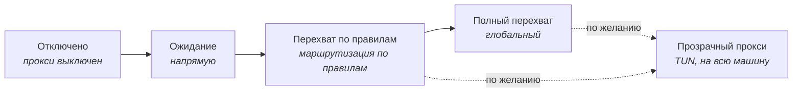

# `Clash#`

**Современный нативный клиент прокси для Windows на ядре [mihomo](https://github.com/MetaCubeX/mihomo).**

[English](./README.md) · [简体中文](./README-zh.md) · **Русский** · [فارسی](./README-fa.md)

---

> [!IMPORTANT]
> **1.0.0 в разработке и сейчас остановлен на проверенной контрольной точке.**
> Контрольная точка — `main` [`065a5d5`](https://github.com/Water-Run/ClashSharp/commit/065a5d5), тег [`v1.0.0-checkpoint.20260912`](https://github.com/Water-Run/ClashSharp/releases/tag/v1.0.0-checkpoint.20260912).
> Официального релиза ещё нет — пакеты CI служат только для проверки, это не выпуск.

| Область | Состояние на контрольной точке |
| :--- | :--- |
| **Тесты** | 4800 локальных тестов проходят — ноль ошибок, ноль пропусков |
| **Сборка** | Release x64 для 18 проектов — ноль предупреждений, ноль ошибок |
| **Установщик** | Реальные установка, восстановление, удаление, восемь сценариев прерывания/блокировки файлов, восстановление занятого дескриптора службы и восстановление после перезагрузки Windows |
| **Среда выполнения** | Реальная перезагрузка ядра, ограниченное восстановление после сбоя, изоляция сеанса после перезапуска хоста службы и удаление при работающем ядре |
| **Сеть** | 32/32 изолированных проверки узлов и HTTPS-пересылка по существующей конфигурации Clash |
| **Осталось** | Взаимодействие со страницами WPF, штатное завершение, автоматическая очистка пустых каталогов, полная матрица выпуска |

Точные кандидаты, границы доказательств, оставшаяся работа и позднейшая документация: **[текущее состояние разработки](./docs/reviews/2026-09-17-development-status.md)** · **[журнал 1.0.0](./docs/reviews/1.0.0-execution-ledger.md)** · [контрольная точка паузы](./docs/reviews/2026-09-12-pause-checkpoint.md) · [приёмка на сервере](./docs/reviews/2026-09-12-server-acceptance.md)

## Нативный Windows по замыслу

Clash# нативен не только стеком — `C#` + WinUI 3, Fluent-страницы и упаковка `.msix` это основа, а не набор функций. Приложение строится вокруг сетевого поведения Windows, а не вокруг универсальной кроссплатформенной терминологии прокси.

| Область | Что даёт Clash# |
| :--- | :--- |
| **Оболочка** | Нативные элементы WinUI 3, значки Fluent и акрил Windows 11 |
| **Главное управление** | Плитки статуса и частых действий по образцу быстрых настроек Windows |
| **Жизненный цикл** | Отдельный установщик/удаление, обнаружение и устранение конфликтов прокси при запуске |
| **Восстановление** | При аварийном выходе одноразовый Recovery Watchdog сразу восстанавливает системный прокси, всё ещё принадлежащий Clash#; помощник входа — только запасной вариант на следующий вход |
| **Средства ремонта** | Быстрый сетевой ремонт WSL, терминала и Microsoft Store; очистка остатков прокси; восстановление системного прокси при выходе |
| **Перехват** | Fail-closed прозрачный прокси через TUN |
| **Языки** | Каталоги интерфейса: упрощённый китайский, традиционный китайский, английский, русский, французский, немецкий и персидский (справа налево) |

## Установка

> [!NOTE]
> После официального выпуска пакеты появятся в [GitHub Releases](https://github.com/Water-Run/ClashSharp/releases).

1. Скачайте и распакуйте пакет выпуска. В нём `ClashSharp-Installer.exe` и соседний каталог `payload` — **держите их вместе**.
2. Запустите подписанный Authenticode `ClashSharp-Installer.exe` **из обычного пользовательского сеанса**. Установщик — автономный исполняемый файл WPF, предустановленный .NET не нужен.
3. Примите запрос UAC для машинной службы и необходимого доверия к машинному сертификату — **сначала проверьте проверенного издателя**. Пакет приложения принадлежит пользователю, который запустил установщик.

Установщик проверяет совместимость Windows 11 x64, при необходимости ставит сертификат пакета и разворачивает MSIX. Проверенные файлы сертификата и MSIX — и цепочка их каталогов — остаются заблокированными только на чтение для каждого потребителя; личность и SHA-256 перепроверяются сразу до и после использования. После развёртывания каждый файл пакета сверяется с подписанной block map, а MSIX включает enforcement целостности пакета Windows.

Если Clash# уже установлен, установщик входит в **режим обслуживания**: проверка, обновление/восстановление на месте или удаление.

> [!WARNING]
> Удаляйте только через `ClashSharp-Installer.exe`. Снятие одного MSIX в параметрах Windows может оставить машинные ресурсы службы.

<b>Гарантии выпускной сборки и подписи</b>

 

Разрешение зависимостей и сборка payload при выпуске **полностью офлайн**: каждый проект .NET использует ранее зафиксированный locked restore.

- Сборка **завершается отказом**, если зафиксированный манифест версии/длины/SHA-256 Mihomo не совпадает с обычным двоичным файлом, и если все четыре закреплённых актива GeoData не подготовлены `Tools\Prepare-GeoData.ps1`.
- `Tools\Update-Mihomo.ps1` — явная утилита сопровождающего, **никогда** не неявная загрузка выпускной сборки.
- Каждый запуск использует новый случайный корень staging и допускает только одну объявленную манифестом зависимость x64 Windows App Runtime, требуя её одобренный отпечаток в `CLASHSHARP_WINDOWS_APP_RUNTIME_SIGNER_THUMBPRINT`.
- Официальная упаковка дополнительно требует контролируемый материал подписи MSIX, доверенный Authenticode с меткой времени и явный `CLASHSHARP_WINDOWS_SDK_VERSION`. SignTool принимается только из этого подписанного Microsoft каталога Windows Kits x64, а подпись обращается только к явно настроенной HTTPS-точке метки времени.
- WPF-установщик публикуется как один автономный исполняемый файл в одноразовом staging и переносится в `artifacts\installer\release` только после повторной проверки точного набора файлов, длины и SHA-256.
- `build.ps1 -Development` даёт явно названный, непубликуемый неподписанный артефакт.

## Режимы и понятия

Clash# называет режимы по тому, что они делают с Windows; соответствие распространённым терминам такое:

| Понятие в `Clash#` | Распространённый аналог | Смысл |
| :--- | :--- | :--- |
| Главное управление | Обзор / Главная | Основная страница управления |
| Отключено | Выкл. | Прокси не включён |
| Ожидание | Direct | Прокси включён, прямой режим |
| Перехват по правилам | Rule | Прокси включён, режим правил |
| Полный перехват | Global | Прокси включён, глобальный режим |
| Прозрачный прокси | режим TUN | Прокси включён через TUN |

Порт прослушивания по умолчанию — **`10000`**.

> [!CAUTION]
> Прозрачный прокси нужно включить в настройках, а перехват TUN действует **на всю машину**. Clash# рассчитан на одного интерактивного пользователя и одного владельца Core на машину; **нет** изоляции трафика между сеансами. После выпуска исполнения установщика смена владельца должна быть начата целевым пользователем и явно подтверждена в Repair — обычный Repair владельца не меняет.

## Использование

Для Clash# нужна подписка Clash.

| Страница | Для чего |
| :--- | :--- |
| **Главное управление** | Переключение между отключено, ожиданием, перехватом по правилам и полным перехватом |
| **Прокси** | Узлы, профили, ссылки подписки и правила |
| **Статистика** | Постоянные записи трафика и попаданий правил в SQLite |
| **Журналы** | Ограниченное постоянное хранилище журналов |

### Дополнительно

Можно настроить прозрачный прокси, фоновый опрос соединений, импорт и проверку профилей, тест задержки узлов, нативные действия ремонта Windows, очистку журналов SQLite и отображение для материкового Китая.

> [!TIP]
> Отображение материкового Китая **включено по умолчанию**. Оно меняет только текст регионов и флаги в интерфейсе — профили, журналы, поиск, копирование и экспорт не изменяются.

Язык интерфейса может следовать Windows или задаваться явно. Персидский использует раскладку справа налево.

## Документация

| Документ | Содержание |
| :--- | :--- |
| [Текущее состояние разработки](./docs/reviews/2026-09-17-development-status.md) | Где находится 1.0.0, восстановление закрытого PR и оставшаяся работа |
| [Журнал 1.0.0](./docs/reviews/1.0.0-execution-ledger.md) | Вехи, кандидаты, доказательства и оставшаяся работа |
| [Контрольная точка паузы](./docs/reviews/2026-09-12-pause-checkpoint.md) | Точная граница и точки возобновления текущей паузы |
| [Приёмка на сервере](./docs/reviews/2026-09-12-server-acceptance.md) | Доказательства установки, запуска, восстановления и удаления реального пакета |
| [Заметки по дизайну](./docs/design) | Записи по отдельным возможностям |
| [Журнал архитектуры](./docs/architecture/stabilization-ledger.md) | История стабилизации архитектуры |
| [Стиль кода](./CodingStyle.md) | Соглашения репозитория |

## Лицензия

`Clash#` распространяется как открытый код по лицензии [`AGPL-3.0`](./LICENSE).
