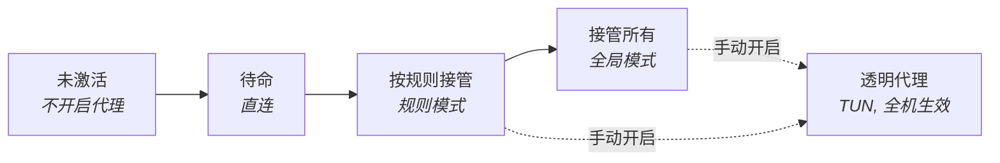

# `Clash#`

**基于 [mihomo](https://github.com/MetaCubeX/mihomo) 内核的现代化 Windows 原生代理客户端.**

[English](./README.md) · **简体中文** · [Русский](./README-ru.md) · [فارسی](./README-fa.md)

---

> [!IMPORTANT]
> **2026-09-22 已恢复 1.0.0 开发, 积累的代码统一归并到 `main`.**
> 设置代际切换继续推进. 自动空目录清理已接入普通卸载, 新安装包的完整验收仍待完成, 见[接入记录](./docs/reviews/2026-09-22-installer-cleanup-integration.md). 下表是历史检查点 [`065a5d5`](https://github.com/Water-Run/ClashSharp/commit/065a5d5) 的证据, 标签为 [`v1.0.0-checkpoint.20260912`](https://github.com/Water-Run/ClashSharp/releases/tag/v1.0.0-checkpoint.20260912).
> 尚无正式发布 —— 当前 CI 产物仅用于验证, 不是发布包.

| 方面 | 检查点处的状态 |
| :--- | :--- |
| **测试** | 4800 项本机测试通过, 零失败, 零跳过 |
| **构建** | 18 项目 Release x64 构建, 零警告, 零错误 |
| **安装器** | 真实安装, 修复, 卸载, 八项中断/文件占用恢复, 服务句柄占用恢复, 以及系统重启后的恢复 |
| **运行时** | 真实核心重载, 有界崩溃恢复, 显式重启服务宿主后的会话隔离, 运行中核心卸载 |
| **网络** | 现有 Clash 配置的 32/32 节点探测与 HTTPS 转发成功 |
| **待完成** | WPF 页面交互, 正常退出, 自动空目录清理, 完整发布矩阵 |

对应候选, 证据边界, 剩余工作与之后的文档: **[当前开发状态](./docs/reviews/2026-09-22-development-status.md)** · **[1.0.0 执行账本](./docs/reviews/1.0.0-execution-ledger.md)** · [暂停检查点](./docs/reviews/2026-09-12-pause-checkpoint.md) · [实机验收](./docs/reviews/2026-09-12-server-acceptance.md)

## 关于 Windows 原生

`Clash#` 是 Windows 原生的. 这不止是技术上使用 `C#` + `WinUI 3` 开发, 契合 Fluent 的页面设计, `.msix` 打包, 还包括其提供的一系列特色功能:

| 方面 | `Clash#` 提供 |
| :--- | :--- |
| **界面** | 原生 WinUI 3 控件, Fluent 图标与 Windows 11 亚克力材质 |
| **主控** | 类似 Windows 快捷设置的磁贴, 呈现状态与常用操作 |
| **生命周期** | 定制的安装, 卸载管理程序; 启动时的代理冲突检测和修复 |
| **恢复** | 异常退出时由一次性 Recovery Watchdog 立即恢复仍归 Clash# 所有的系统代理; 登录恢复助手仅作为下次登录兜底 |
| **修复工具** | WSL, 终端和微软商店的快速网络修正; 代理残留清理; 退出时还原系统代理 |
| **接管** | 通过 TUN 的 fail-closed 透明代理 |
| **语言** | 简体中文, 繁體中文, English, Русский, Français, Deutsch, فارسی（从右到左布局） |

以及其它的有关定制内容.

## 安装

> [!NOTE]
> 正式版本发布后, 发布包会出现在 [GitHub Releases](https://github.com/Water-Run/ClashSharp/releases).

1. 下载并解压发布包. 包内含 `ClashSharp-Installer.exe` 与相邻的 `payload` 目录 —— **两者必须保留在一起**.
2. **在普通用户会话中**直接运行带 Authenticode 签名的 `ClashSharp-Installer.exe`. 安装器自身为绿色自包含程序, 无需预装 .NET.
3. 安装器在配置机器服务及必要的机器证书信任时请求 UAC —— **请先核对已验证的发布者**. 应用包归属运行安装器的当前用户.

安装器会核对 Windows 11 x64 兼容性, 按需安装包证书并部署 MSIX. 证书/MSIX 被消费期间, 其文件与所在目录链持续持有只读锁, 并在使用前后复核同一文件对象的身份与 SHA-256; 部署完成后依据签名 block map 逐项复核全部包作者文件, MSIX 同时启用 Windows package-integrity enforcement.

若已安装 `Clash#`, 安装器进入**维护模式**, 可执行检查, 就地升级/修复或卸载.

> [!WARNING]
> 修复, 升级和完整卸载请重新运行 `ClashSharp-Installer.exe`. 不要只从 Windows 应用管理移除 MSIX, 否则机器级 Service 资源可能无法同步清理.

<b>正式构建与签名保障</b>

 

正式构建的依赖解析与 payload 装配保持**完全离线**: 所有 .NET 项目都使用预先完成的 locked restore, 构建不会联网追踪 Mihomo `latest`.

- 仓库内固定的版本, 长度和 SHA-256 必须与普通二进制完全一致, 并须先通过 `Tools\Prepare-GeoData.ps1` 准备四项固定 GeoData 资产, 否则构建**失败关闭**.
- `Tools\Update-Mihomo.ps1` 是显式的维护者工具, **绝不**作为发布构建的隐式下载.
- 每次打包都会使用全新随机 staging, 只接纳最终 manifest 声明的唯一 x64 Windows App Runtime 依赖, 并要求通过 `CLASHSHARP_WINDOWS_APP_RUNTIME_SIGNER_THUMBPRINT` 固定其受控 signer thumbprint.
- 正式产物还要求受控的 MSIX 证书, 可信且带时间戳的 Installer Authenticode 签名, 以及显式的 `CLASHSHARP_WINDOWS_SDK_VERSION`; SignTool 只接受该固定 Windows Kits x64 目录中通过 Microsoft 签名信任校验的版本, 签名阶段仅联系显式配置的 HTTPS 时间戳服务.
- WPF Installer 只在可清理的 staging 中发布为单个自包含可执行文件; 精确文件集合, 长度与 SHA-256 契约复核一致后, 才会提升到 `artifacts\installer\release`.
- `build.ps1 -Development` 只生成明确标记为不可发布的未签名开发产物.

## 模式与概念

`Clash#` 按"对 Windows 做了什么"命名模式, 和主流软件的概念大致映射如下:

| `Clash#` 中的概念 | 主流软件中的概念 | 说明 |
| :--- | :--- | :--- |
| 主控 | 概览 / 主页 | 核心控制页面 |
| 未激活 | 关闭 | 不开启代理 |
| 待命 | 直连 | 开启代理, 直连模式 |
| 按规则接管 | 规则 | 开启代理, 规则模式 |
| 接管所有 | 全局 | 开启代理, 全局模式 |
| 透明代理 | TUN 模式 | 开启代理, 且使用 TUN 模式 |

`Clash#` 预设的默认端口是 **`10000`**.

> [!CAUTION]
> 透明代理需要在设置中打开. TUN 会接管整台机器的路由与 DNS; `Clash#` 当前按"一台机器, 一个交互用户, 一个 Core 所有者"设计, **不支持**多用户会话隔离. 正式安装器开放执行后, 更换所有者必须由目标用户重新运行 Installer, 并在 Repair 中明确确认重新关联; 普通 Repair 不会隐式换绑.

## 快速上手

欲使用 `Clash#`, 显然你需要一个 `Clash` 订阅.

| 页面 | 用途 |
| :--- | :--- |
| **主控** | 在未激活, 待命, 按规则接管和接管所有之间切换 |
| **代理** | 管理节点, 配置, 订阅链接与规则 |
| **统计** | 查看 SQLite 持久化的流量记录与规则命中 |
| **日志** | 查看有界持久化的日志存储 |

### 进阶使用

进阶用户可以配置透明代理, 后台连接采样, 配置导入与校验, 节点延迟测试, Windows 原生修复动作, SQLite 日志清理和中国大陆显示策略.

> [!TIP]
> 中国大陆显示**默认开启**. 它只改变 UI 层的地区显示文本与旗帜呈现, 不会修改配置, 日志, 搜索, 复制或导出的数据.

界面语言可跟随 Windows, 也可在设置中显式选择. 波斯语使用从右到左布局.

## 文档

| 文档 | 内容 |
| :--- | :--- |
| [当前开发状态](./docs/reviews/2026-09-22-development-status.md) | 1.0.0 所处位置, 主线归并与 PR 处理, 以及剩余工作 |
| [1.0.0 执行账本](./docs/reviews/1.0.0-execution-ledger.md) | 里程碑, 候选, 证据与剩余工作 |
| [暂停检查点](./docs/reviews/2026-09-12-pause-checkpoint.md) | 本次暂停的确切边界与恢复入口 |
| [实机验收](./docs/reviews/2026-09-12-server-acceptance.md) | 真实新包的安装, 首次启动, 修复与卸载证据 |
| [设计记录](./docs/design) | 逐特性的设计文档 |
| [架构账本](./docs/architecture/stabilization-ledger.md) | 架构稳定化历史 |
| [编码风格](./CodingStyle.md) | 仓库编码约定 |

## 许可

`Clash#` 以 [`AGPL-3.0`](./LICENSE) 协议开源于 [GitHub](https://github.com/Water-Run/ClashSharp).
