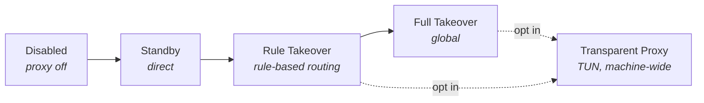

# `Clash#`

**A modern, Windows-native proxy client built on the [mihomo](https://github.com/MetaCubeX/mihomo) core.**

**English** · [简体中文](./README-zh.md) · [Русский](./README-ru.md) · [فارسی](./README-fa.md)

---

> [!IMPORTANT]
> **1.0.0 is in development and currently paused at a verified checkpoint.**
> The checkpoint is `main` [`065a5d5`](https://github.com/Water-Run/ClashSharp/commit/065a5d5), tagged [`v1.0.0-checkpoint.20260912`](https://github.com/Water-Run/ClashSharp/releases/tag/v1.0.0-checkpoint.20260912).
> No formal release exists yet — CI packages are validation artifacts, not releases.

| Area | State at the checkpoint |
| :--- | :--- |
| **Tests** | 4800 local tests pass — zero failures, zero skips |
| **Build** | 18-project Release x64 build — zero warnings, zero errors |
| **Installer** | Real install, repair, uninstall, eight interruption/file-lock recoveries, held-service-handle recovery, and recovery across a Windows restart |
| **Runtime** | Real core reload, bounded crash recovery, session isolation after a restarted service host, and active-core uninstall |
| **Networking** | 32/32 isolated node probes and HTTPS forwarding against an existing Clash configuration |
| **Pending** | WPF page interaction, graceful shutdown, automatic empty-directory cleanup, complete release matrix |

Exact candidates, evidence boundaries, remaining work, and later documentation: **[current development status](./docs/reviews/2026-09-17-development-status.md)** · **[1.0.0 execution ledger](./docs/reviews/1.0.0-execution-ledger.md)** · [pause checkpoint](./docs/reviews/2026-09-12-pause-checkpoint.md) · [server acceptance](./docs/reviews/2026-09-12-server-acceptance.md)

## Windows-Native by Design

Clash# is native beyond the toolchain — `C#` + WinUI 3, Fluent page design, and `.msix` packaging are the foundation, not the feature set. The application is built around Windows networking behavior rather than generic cross-platform proxy terminology.

| Area | What Clash# provides |
| :--- | :--- |
| **Shell** | Native WinUI 3 controls, Fluent icons, and Windows 11 acrylic surfaces |
| **Master control** | A tile-based surface for status and common actions, modeled on Windows Quick Settings |
| **Lifecycle** | A dedicated installer/uninstaller, and proxy conflict detection and repair at startup |
| **Recovery** | On abnormal exit, a one-shot Recovery Watchdog immediately restores the system proxy still owned by Clash#; a logon helper is only the next-logon fallback |
| **Repair tools** | Quick network repair for WSL, terminals, and the Microsoft Store; proxy residue cleanup; system proxy restoration on exit |
| **Takeover** | Fail-closed transparent proxy activation through TUN |
| **Languages** | Interface catalogs for Simplified Chinese, Traditional Chinese, English, Russian, French, German, and Persian (RTL) |

## Installation

> [!NOTE]
> Once a formal version is published, packages appear on [GitHub Releases](https://github.com/Water-Run/ClashSharp/releases).

1. Download and extract the release package. It contains `ClashSharp-Installer.exe` and its sibling `payload` directory — **keep them together**.
2. Run the Authenticode-signed `ClashSharp-Installer.exe` **from your normal user session**. The installer is a self-contained WPF executable and needs no preinstalled .NET.
3. Accept the UAC prompt for the machine service and any required machine certificate trust — **check the verified publisher first**. The application package itself belongs to the user who ran the installer.

The installer verifies Windows 11 x64 compatibility, installs the package certificate when needed, and deploys the MSIX package. Verified certificate and MSIX files — and their directory chain — stay read-only locked through every consumer, with identity and SHA-256 rechecked immediately before and after use. After deployment, every package-authored file is verified against the signed block-map payload, and the MSIX enables Windows package-integrity enforcement.

If Clash# is already installed, the installer enters **maintenance mode** for check, in-place update/repair, or uninstall.

> [!WARNING]
> Always uninstall through `ClashSharp-Installer.exe`. Removing only the MSIX from Windows Settings can leave machine-level service resources behind.

<b>Release build and signing guarantees</b>

 

Release dependency resolution and payload assembly are **fully offline**: every .NET project uses the prior locked restore.

- The build **fails closed** unless a checked-in Mihomo version/length/SHA-256 manifest matches the bundled ordinary binary, and all four pinned GeoData assets have been prepared with `Tools\Prepare-GeoData.ps1`.
- `Tools\Update-Mihomo.ps1` is an explicit maintainer utility — **never** an implicit release-build download.
- Every run uses a new random staging root and admits only the single manifest-declared x64 Windows App Runtime dependency, requiring its approved signer thumbprint in `CLASHSHARP_WINDOWS_APP_RUNTIME_SIGNER_THUMBPRINT`.
- Official packaging additionally requires controlled MSIX signing material, a trusted timestamped Authenticode certificate, and an explicit `CLASHSHARP_WINDOWS_SDK_VERSION`. SignTool is accepted only from that Microsoft-signed Windows Kits x64 directory, and signing contacts only the explicitly configured HTTPS timestamp endpoint.
- The WPF installer is published as one self-contained executable in disposable staging, and is promoted to `artifacts\installer\release` only after its exact file set, length, and SHA-256 contract is rechecked.
- `build.ps1 -Development` produces an explicitly named, non-publishable unsigned artifact.

## Modes and Concepts

Clash# names its modes after what they do to Windows, which maps onto mainstream terminology as follows:

| Concept in `Clash#` | Mainstream equivalent | Meaning |
| :--- | :--- | :--- |
| Master Control | Overview / Home | The core control page |
| Disabled | Off | Proxy is not enabled |
| Standby | Direct | Proxy enabled, direct mode |
| Rule Takeover | Rule | Proxy enabled, rule mode |
| Full Takeover | Global | Proxy enabled, global mode |
| Transparent Proxy | TUN mode | Proxy enabled through TUN |

The default listening port is **`10000`**.

> [!CAUTION]
> Transparent proxy must be enabled in settings, and TUN takeover is **machine-wide**. Clash# is designed for one interactive user and one Core owner per machine; it does **not** provide multi-session traffic isolation. Once installer execution is released, ownership reassociation must be started by the target user and explicitly confirmed in Repair — ordinary Repair never changes ownership implicitly.

## Usage

You need a Clash subscription to use Clash#.

| Page | Use it for |
| :--- | :--- |
| **Master Control** | Switching between disabled, standby, rule takeover, and full takeover |
| **Proxies** | Nodes, profiles, subscription links, and rules |
| **Statistics** | Persistent SQLite-backed traffic records and rule hits |
| **Logs** | Bounded, persisted log storage |

### Advanced

Advanced users can configure transparent proxy mode, background connection sampling, profile import and validation, node latency testing, Windows-native repair actions, SQLite log cleanup, and mainland China display behavior.

> [!TIP]
> Mainland China display is **enabled by default**. It changes regional display text and flag presentation at the UI layer only — profiles, logs, search, copy, and exported data are never modified.

The interface language can follow Windows or be set explicitly. Persian uses a right-to-left layout.

## Documentation

| Document | Contents |
| :--- | :--- |
| [Current development status](./docs/reviews/2026-09-17-development-status.md) | Where 1.0.0 stands, closed PR recovery, and remaining work |
| [1.0.0 execution ledger](./docs/reviews/1.0.0-execution-ledger.md) | Milestones, candidates, evidence, and remaining work |
| [Pause checkpoint](./docs/reviews/2026-09-12-pause-checkpoint.md) | Exact boundary and resumption entry points for the current pause |
| [Server acceptance](./docs/reviews/2026-09-12-server-acceptance.md) | Real package install, startup, repair, and uninstall evidence |
| [Design notes](./docs/design) | Per-feature design records |
| [Architecture ledger](./docs/architecture/stabilization-ledger.md) | Architecture stabilization history |
| [Coding style](./CodingStyle.md) | Repository coding conventions |

## License

`Clash#` is open-source under the [`AGPL-3.0`](./LICENSE) license.
