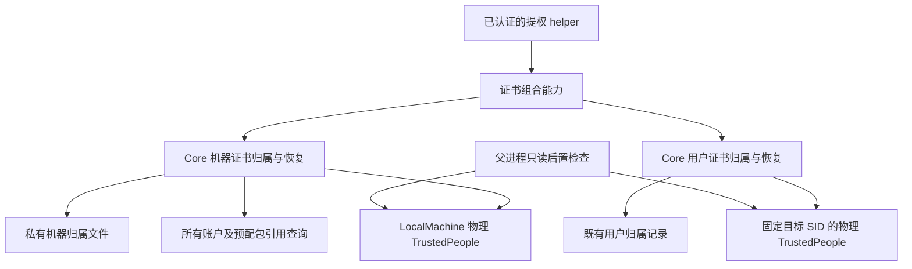

# 安装器机器证书归属与恢复

M5b 修正了 M5a 中实际 MSIX 部署暴露的信任范围问题。安装器现在独立管理机器
TrustedPeople 证书，同时保留用户证书与旧账户清理的原有授权模型。版本仍为 1.0.0。

## 已连接的实现

- Core 只依赖持久化、证书和包引用端口，不引用 Windows API、WPF 或 WinUI。
- 机器归属文件固定为私有 `InstallerAuthority/v1/machine-certificate-ownership-v1.json`，
  使用既有 SYSTEM/Administrators 根目录与文件 ACL、句柄固定和原子写入能力。
  用户可读的 v2 事务记录、旧账户证书 schema 和账户迁移权限没有复用为机器授权。
- 记录绑定包名、发布者、发布者 ID、完整 DER 摘要、证书指纹与随机归属 ID。
  固定的存储范围也进入规范化 JSON；遗漏、重复、未知字段、错误类型、范围改写和
  非规范表示均拒绝。该记录不包含目标 SID，因此不会因交互账户换绑而改写机器归属。
- 已有的精确证书记录为非安装器所有。缺失时先持久化归属，再导入公开代码签名证书。
  修复可重新导入丢失证书；记录原本非自有而证书后来消失时，先写入新的所有权状态。
- 卸载只删除有归属记录且完整 DER 与指纹均一致的自有证书。删除前查询所有账户、
  staged 和 provisioned 包；任一同发布者包仍在使用时保留证书与归属记录，查询失败
  不等于没有引用。记录在确认删除后最后清除。
- 证书与文件操作的异常、取消和进程退出保留可重读证据；未知状态不能被报告为成功。
  删除前后的多次包查询不声称能够锁住其他程序发起的 AppX 部署。若删除后出现新引用，
  保留归属并报告需要恢复；仍有引用但自有证书已经丢失时也不会清除恢复记录。
- helper 在证书准备、包提交及最终验证处执行组合能力；退出时释放私有根目录守卫。
  父进程只读检查用户与机器两处后置状态。旧账户独立卸载仍只能删除自己的用户证书。

## 原生验证发现并修复的问题

### 逻辑证书库跨范围继承

仅固定 `TrustedPeople` 名称与 SID 还不够。Windows 的逻辑用户证书库继承机器证书；
在机器证书存在、物理用户记录不存在时，旧适配器实际返回 `ExactMatch`。
故障收据的 run ID 为 `20403c41e0b44d0aa80f978cd59662ab`。

用户、归档用户与机器适配器现在使用 `CERT_STORE_PROV_SYSTEM_REGISTRY_W`，
只枚举和修改绑定的物理注册表存储。当前用户适配器先验证调用令牌的 SID，再复用
相同的精确用户能力，避免重复维护另一套导入与删除代码。安装器不打开 Root，
用户删除也不会操作机器或策略存储中的同一张证书。

新增三种删除入口的实际回归：当前用户、固定目标用户、归档用户。每种均在隔离 CI 中
放置唯一临时机器证书及用户副本，删除用户副本后确认机器副本仍在，最后精确清理。
依据：[逻辑用户库继承](https://learn.microsoft.com/en-us/windows-hardware/drivers/install/local-machine-and-current-user-certificate-stores)、
[CertOpenStore 物理与逻辑 provider](https://learn.microsoft.com/en-us/windows/win32/api/wincrypt/nf-wincrypt-certopenstore)。

### Authenticode 状态生命周期

原实现使用默认 `WTD_STATEACTION_IGNORE`，之后却尝试从已释放的状态读取签名证书。
真实 Microsoft 签名的 SDK `dotnet.exe` 因此被误拒绝为 signer missing。现在显式使用
VERIFY，并在所有完成、拒绝和取消路径执行 CLOSE。仍要求 WinVerifyTrust 返回零、
固定签名者指纹与同一被锁定的文件；没有接受不可信自签名、未签名或篡改映像的例外。

修复前五项原生测试中四项失败；修复后，可信签名读取、精确锁定、错误签名者拒绝、
保留原签名但修改代码段的拒绝、未签名文件拒绝均通过。测试只复制并读取 SDK 映像，
不运行副本或修改证书存储。
依据：[WINTRUST_DATA](https://learn.microsoft.com/en-us/windows/win32/api/wintrust/ns-wintrust-wintrust_data)。

### 管理员令牌成员检查

原 helper 用 Query-only 令牌调用 `WindowsPrincipal.IsInRole`；.NET 对主令牌的成员
检查需要先复制令牌，真实已提权客体也因此抛出 SecurityException。现在请求
`Query | Duplicate`，仅允许完成成员检查，没有修改令牌权限或提升当前进程。
真实回归同时接受已提权成功和未提权的稳定拒绝诊断。
依据：[.NET 10.0.5 WindowsPrincipal 实现](https://raw.githubusercontent.com/dotnet/runtime/v10.0.5/src/libraries/System.Security.Principal.Windows/src/System/Security/Principal/WindowsPrincipal.cs)。

## 实际验证范围

- 18 项目 Release x64 构建零警告、零错误；locked restore 成功。
- 本机安全子集共 4370 项通过：主程序 2330、Core 970、Presentation 125、Windows 945；
  四份 TRX 无失败或跳过。另六项真实证书修改测试未被本机筛选，留给隔离环境。
- format 检查 1394 个文件，零处变更。
- 独立 Windows 11 build 26100 客体运行 20 个独立原生进程，共 138 项断言，包含四个
  写入/导入/删除/清除提交点的真实进程强制退出以及新进程恢复。实际 MSIX 安装后
  引用查询保留证书；精确包卸载后才删除自有信任。
- 同一矩阵还验证了预先存在证书的保留、丢失证书的修复、用户/机器隔离，以及真实
  组合能力在安装、修复和卸载中的双归属记录与父进程后置检查。
- 客体十项清理后置条件均为 true：测试包和证书消失，暂存目录与测试产品目录移除，
  新增依赖清理，证书存储、服务及代理快照恢复，自有进程消失，测试 ACL 恢复。
  主机另确认 Sandbox ID 消失、只读输入摘要未变、本机代理摘要未变。

最终原生 run ID：`ec276d3a463b4e7faf5444904f0c8e8c`；
Sandbox ID：`4271e0e0-c5b5-43ef-a012-61068cfcfa36`。
原始证据保存在 `artifacts/validation/machine-certificate-sandbox-<run ID>/`。

| 验证对象 | SHA-256 |
| --- | --- |
| 实际 MSIX（4fcc24d 开发候选） | `0decd92d161039654fb00e832da642ca1343a8832168b4ad746aa4f7fb4f4e68` |
| 探针使用的 Installer Core DLL | `81f7d4efe169183578fb0a605f64d73fe92875ef10e76d6c97d795594b7fc21d` |
| 探针使用的 Installer Windows DLL | `283571377bd846d46938bd48e070372f6b0bc200defeff5ea50d7b9c7e2d2767` |
| 客体最终报告 | `67ed11ba8ed18756e683585930b259effb24a1f191c9a2772a8cbf0a632c4696` |
| 主机最终报告 | `a737d1dc0571fc1ed1a13923cf4833ffb849eff0b75ee7a35858348a1bc283c8` |

## 边界与剩余工作

本轮客体默认卷根 ACL 含有允许 Authenticated Users 删除根目录对象的显式规则，
被既有生产根目录策略拒绝。探针只在已确认的独立客体中暂时移除该精确规则的 DELETE
位，保留其他规则，结束时恢复原始 SDDL 并核对。生产 ACL 策略没有放宽。
因此这证明的是该受控客体中的实际证书、持久化和包引用能力，不是原样 Sandbox
系统上的完整安装器验收。早期一次基于 Set-Acl 的夹具准备超时，已中止并销毁所属
客体，没有将缺少结束报告的运行计为通过。

探针直接调用编译后的生产组件，未走正常 WPF 安装入口、完整认证管道或 SCM 服务
修改。它也没有检验正式签名发行、所有页面、完整卸载数据清除与全套机器故障矩阵。
当前候选仍为 Development-Unsigned，生产执行门保持关闭。跨发布者证书轮换、其他
产品最后释放引用后的共享信任回收，以及正式签名安装矩阵继续独立推进。

本轮曾因过宽的测试筛选在开发机误选原有三个 CurrentUser 测试，其中一项进行了唯一
临时证书的导入/删除往返。事后只读复核临时证书残留为零，机器候选证书不存在，原
Clash Nyanpasu 进程与代理保持。该事件记录在
`artifacts/verification/host-test-filter-incident-m5b.json`。已给真实证书测试加入
托管 CI / Sandbox 环境限制；本机最终回归仍显式排除整个真实修改测试类。
