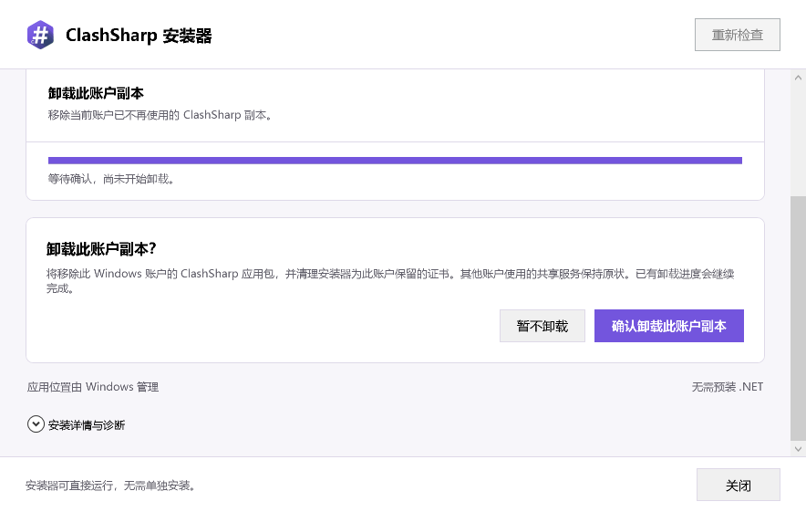

# 迁移后旧账户的独立卸载

旧账户卸载自己的安装时，共享服务已经可能属于新账户。因此，这条流程必须使用独立的认证入口和恢复记录，并且不持有共享服务、关联文件或共享载荷的修改能力。普通卸载事务和 AllowReassociation 不提供这项权限。

## M4u 已实现的证书清理

迁移时保存的旧账户证书可能与当前候选包的签名证书不同。[InstallerArchivedCertificateRemoval](../../ClashSharp/ClashSharp.Installer.Core/Certificates/InstallerArchivedCertificateRemoval.cs)直接使用私有归档里的旧身份，不制造另一个已验证 release，也不借用当前候选包的证书身份授权删除。它只接收归档存储、精确检查/删除端口和独立卸载边界验证器，没有证书导入或机器修改接口。

执行顺序为：验证旧账户及包缺席等前提，读取准确归档，检查受管证书是否存在身份冲突，持久释放唯一引用，再精确删除安装器曾导入的证书。确认删除完成且边界仍然成立后，才清除引用为零的准确归档。预先存在的证书不打开其存储进行检查或修改；归档缺失时没有可授权删除的证书身份。

[InstallerArchivedCertificateStore](../../ClashSharp/ClashSharp.Installer.Core/Certificates/InstallerArchivedCertificateStore.cs)只允许读取、释放现有引用和清除已释放记录，不允许创建归属、接管证书或增加引用。它要求规范 JSON、准确 SID、完整快照和内容摘要；写入或删除确认丢失时，持有调用者的权限和句柄，使用不受取消影响的读取观察实际结果。冲突、未知格式和无法观察的结果均保留证据。证书操作失败或取消时，已释放引用的归档仍可供重试。

Windows 持久层只使用既有 InstallerAuthority/v1 下按 SID 摘要固定命名的归档。只读根验证器不会创建目录，也不修改现有 ACL；每次文件操作都会重新验证被固定的目录链。原生文件端口为每种用途绑定唯一叶名称和大小上限，普通迁移日志实例仍拒绝归档文件，归档实例拒绝其他账户、活动账本、普通日志、临时文件和备用数据流。文件必须是单链接普通文件，具有准确的 SYSTEM/Administrators 私有权限。

[WindowsArchivedCertificateRemovalAdapter](../../ClashSharp/ClashSharp.Installer.Windows/Certificates/WindowsArchivedCertificateRemovalAdapter.cs)固定使用调用者认证所确定的目标 SID/TrustedPeople。删除同时匹配 SHA-1 指纹和完整 DER SHA-256，并要求 InstallerOwned 为真、持久引用为零。它不以替代管理员的 CurrentUser 作为目标，不接受载荷或导入请求，不创建证书存储。Windows 释放验证与普通证书适配器共用同一精确身份比较算法。

## M4u 验证范围

新增 95 项测试：Core 54 项，Windows 41 项。完整本机安全测试 4168 项通过、零失败、零跳过：主程序 2330、Core 876、Presentation 109、Windows 853。会修改真实当前用户证书存储的三个既有测试继续只在隔离 CI 执行。18 项目 Release x64 构建零警告、零错误。

隔离 Windows 的两个进程通过 13 个场景、84 项原生断言：真实目标用户证书删除、预先存在证书与无关证书保留、已释放/已删除状态重放、缺失私有根、错误 SID、非规范记录、硬链接、用户可读文件、目录冒充文件、权限晚变，以及写确认丢失后新进程恢复。生产适配器没有创建目录或证书存储；102 个目录打开和 14 个证书存储打开均释放。四张一次性测试证书清理后，TrustedPeople 的完整内容摘要与测试前一致；独立清理脚本再次确认零测试证书、零探针进程，随后移除隔离测试树。

原生探针使用的 Windows 程序集 SHA-256 为 1a0d06013fd697287099bc9382b4824d88a082a0b28307c751e03f0d34e07d4a，Core 为 4017192a735b4233bc4b6358a12398751b997e70351131179ae8e931f2a19916。它们是本阶段源代码的提交前构建，源链接基线为 7459de5；不等同于后续 CI 包中的程序集。原始收据为 artifacts/validation/archived-certificate-m4u-{run,resume,cleanup}.json，汇总为 artifacts/verification/archived-certificate-validation-m4u.json。

## M4v 完整会话与 WPF 入口

已接通独立启动模式、同一签名程序的 PID/SID 与管道认证、父进程包卸载、归档证书清理、恢复记录和单页 WPF 操作。详情区的“卸载此账户副本”先显示明确确认；拒绝或关闭确认时不调用后端。确认按钮不接受默认回车，取消按钮优先获得焦点。普通安装状态因其他账户的 ACL 无法读取时，这个独立入口仍可使用。

私有 `retired-uninstall-v1.json` 绑定已认证账户和准确候选版本/摘要。父进程只能提出新的 Prepared 请求，helper 自己读取或创建权威状态，再返回规范的公开快照；拒绝原因仅通过有界诊断回执返回。五个卸载阶段均可恢复，已验证清除之前，普通安装和账户迁移都被该记录阻断。写入或删除确认丢失时，继续持有作用域并读取实际结果。

[WindowsRetiredUninstallAuthorityFactory](../../ClashSharp/ClashSharp.Installer.Windows/Retirement/WindowsRetiredUninstallAuthorityFactory.cs)连续保留全局排他、旧账户 App 屏障、候选及只读共享状态。它不获取新账户 App 屏障。共享状态检查固定目录、准确账户只读 ACL、单链接关联文件及规范内容，并要求普通事务不存在；关联已移除时，还必须证明服务缺席。当前账户仍拥有共享服务、根或权限异常、关联改变、账户路径改变以及普通事务出现均阻断后续步骤。生产组合不提供共享服务、关联或载荷修改端口。

父进程复用同一个认证管道调用既有协调器及包卸载适配器。helper 独立查询目标账户的 AppX 包缺席后，才清理 M4u 的归档证书并确认 PackageCommitted。父进程的只读状态来自已验证回执，无法确定通信结果时不能推断进度。最终 Verify/Clear 再次检查包、证书归档及共享边界，清除自己的私有日志，关闭时等待 helper 实际退出。

本阶段新增 127 项测试。完整本机安全测试 4295 项通过、零失败、零跳过：主程序 2330、Core 924、Presentation 125、Windows 916。包括实际 Core 协调器、认证管道主机和 broker、私有存储与证书执行器的组合测试，以及包移除后取消、保留证据并由新会话续接。身份验证器、包操作和证书原生副作用在这些单元/集成测试中使用模拟端口。三个既有真实证书存储测试仍仅在隔离 CI 执行。18 项目 Release x64 构建零警告/错误；format 1381 文件零处变更，无工作区警告。

最终程序集在隔离 Windows 两个进程中通过 16 个场景、60 项原生断言，覆盖真实目录 ACL、关联文件硬链接/可写权限、私有日志硬链接/非规范/错误账户/目录冒充、写确认丢失及新进程恢复和清除。232 个目录打开全部释放，私有目录创建端口调用 28 次（含既有目录确认）。测试树于 2026-09-07T07:31:01.3284239Z 清除，没有遗留探针进程，也没有包、证书、服务或代理修改。此探针的账户路径解析和服务缺席前提为模拟，不计作实际双账户安装验收。

原生 Windows DLL SHA-256 为 `cc093ebf740ed3635938cf0a0ef1c75104a80c642a59dd5bc654c4f3d386d2ba`，Core 为 `00abda43bfefad6db4bedc1787172cb0bdd57b32284621ba9e6e36541ff04d00`。实际 WPF MainWindow 的模拟运行时渲染通过 133 项检查、45 张渲染，含最小窗口、2 倍输出和卸载结果；未显示窗口或调用生产运行时。原始证据为 `artifacts/validation/retired-uninstall-m4v-{run,resume,cleanup}.json` 与 `artifacts/validation/installer-shell-m4v-final/receipt.json`。程序集均来自本阶段提交前最终构建，源链接基线为 `567f093`，不能与后续 CI 包的摘要混用。

## 待完成的发布验收

独立卸载源代码已连接，1.0.0 生产执行门仍关闭。正式签名候选包还需在 Windows 11 上完成标准用户、替代管理员、安装、修复、升级、降级拒绝、卸载及中断故障矩阵。离屏 WPF 检查也不能替代实际桌面的键盘、UIA、Narrator 和跨屏 DPI 验收。
